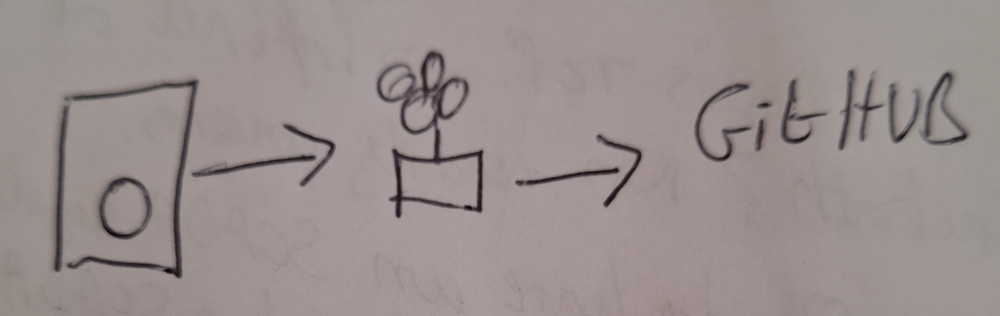

After my [previous attempt with the GitHub Android app didn't work](../2025/07/26/example-image-upload-from-phone.html), I decided to try Termux - a powerful terminal emulator for Android that gives you full git functionality.

This post demonstrates the complete workflow from first-time setup to uploading images directly from my phone to this blog.

## First-Time Setup

### Installing and Setting Up Termux

1. **Install Termux** from F-Droid (recommended) or Google Play Store
2. **Open Termux** and run the initial setup:

```bash
# Update packages
pkg update && pkg upgrade

# Install essential tools
pkg install git gh openssh

# Set up storage access (grant permission when prompted)
termux-setup-storage
```

### Connecting to GitHub

3. **Authenticate with GitHub** using the GitHub CLI:

```bash
# Login to GitHub
gh auth login
```

Follow the prompts to authenticate via web browser or token.

### First Clone of the Repository

4. **Clone your blog repository**:

```bash
# Clone the repository
git clone https://github.com/davegoopot/davegoopot.github.io.git

# Navigate to the repository
cd davegoopot.github.io

# Verify the clone worked
ls -la
```

5. **Configure git identity** (if not already done):

```bash
git config --global user.name "Your Name"
git config --global user.email "your.email@example.com"
```

## Uploading an Image

Now for the actual workflow demonstration. I drew a quick diagram on paper and photographed it with my phone.

### Step 1: Copy the Image

```bash
# Navigate to the repository
cd davegoopot.github.io

# Copy image from camera folder to images directory
cp /sdcard/DCIM/Camera/IMG_20250726_120000.jpg images/2025-07-26-termux-workflow-diagram.jpg
```

### Step 2: Commit and Push

```bash
# Add the image
git add images/2025-07-26-termux-workflow-diagram.jpg

# Commit with descriptive message
git commit -m "Add Termux workflow diagram for mobile blogging post"

# Push to GitHub
git push
```

## The Result


*Caption: Hand-drawn diagram uploaded successfully using Termux.*

## How Did It Go?

**Much better than the GitHub Android app!** Here's what worked:

1. ✅ **Full git functionality** - Unlike the GitHub app, Termux gives you complete git access
2. ✅ **File system access** - Easy to copy images from camera folder
3. ✅ **Command line control** - Can rename files, organize folders, and write proper commit messages
4. ✅ **Image optimization** - Can install ImageMagick to compress images if needed
5. ✅ **Complete workflow** - Can write entire blog posts, not just upload files

### Workflow Comparison

| Feature | GitHub Android App | Termux |
|---------|-------------------|---------|
| Upload files | ❌ (couldn't find option) | ✅ Easy |
| Rename files | ❌ | ✅ Full control |
| Organize folders | ❌ | ✅ Complete |
| Commit messages | ❌ | ✅ Descriptive |
| Image optimization | ❌ | ✅ ImageMagick available |
| Write posts | ❌ | ✅ Full text editing |

## Next Steps

This Termux setup opens up a completely mobile blogging workflow. I can now:

- Sketch diagrams on paper
- Photograph them with my phone
- Upload and commit them via Termux
- Write entire blog posts on my phone
- Publish everything without touching a computer

For a more detailed guide on daily usage and advanced tips, see the [Mobile Workflow Guide](../../docs/mobile-workflow-guide.html) in the documentation.

**Verdict**: Termux is a game-changer for mobile blogging. While it requires a bit more setup than a simple app, the power and flexibility make it worth the effort.